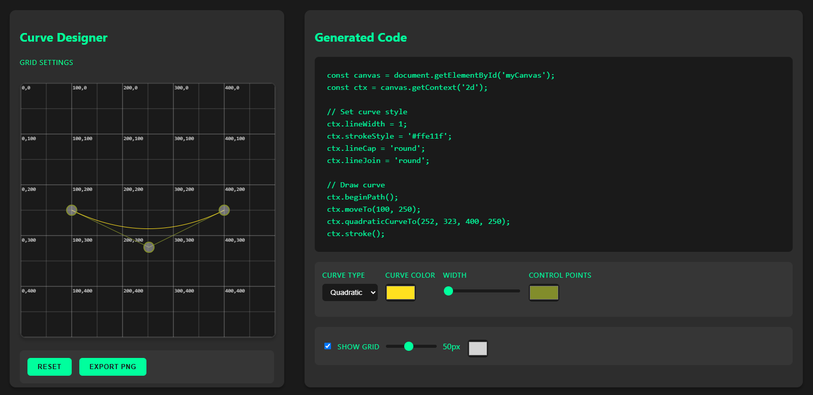

# Curve Designer Tool

A dynamic, interactive web-based tool for designing and exporting Bézier and quadratic curves with real-time code generation.



## Features

- Interactive curve manipulation with draggable control points
- Support for both quadratic and Bézier curves
- Real-time generated JavaScript code
- Customizable styling options:
  - Curve color and width
  - Control point colors
  - Grid display with adjustable size
- Export functionality to PNG
- Grid system with coordinate display
- Responsive design with a dark theme UI

## Usage

### Basic Controls

1. Select curve type (Quadratic/Bézier) from the dropdown
2. Drag control points to modify the curve shape
3. Use the styling controls to customize appearance:
   - Curve color picker
   - Line width slider
   - Control point color picker

### Grid Features

- Toggle grid display with the checkbox
- Adjust grid size using the slider (10px to 100px)
- Grid shows coordinates at major intersections
- Customize grid color

### Export Options

- Click "Export PNG" to save your curve design as an image
- Copy the generated JavaScript code for use in your own projects

## Technical Details

### Canvas Setup

The tool uses HTML5 Canvas for rendering with the following specifications:
- Canvas dimensions: 500x500 pixels
- Support for both quadratic and Bézier curve types
- Real-time coordinate tracking
- Smooth curve rendering with rounded caps and joins

### Styling

The interface features a modern dark theme with:
- Primary accent color: #00ff9d
- Background: #1a1a1a
- Secondary background: #2d2d2d
- Custom scrollbar styling
- Responsive control panels

### Generated Code

The tool automatically generates clean, reusable JavaScript code that includes:
- Canvas context setup
- Style configurations
- Curve drawing commands
- Complete curve parameters

## Browser Compatibility

Compatible with modern browsers that support:
- HTML5 Canvas
- ES6 JavaScript
- Modern CSS features (Flexbox, Custom Properties)

## Getting Started

1. Open the HTML file in a modern web browser
2. Start designing by dragging the control points
3. Customize the curve appearance using the control panel
4. Export your design or copy the generated code

## File Structure

```
curve-designer/
├── index.html       # Main application file
└── styles/          # Included in HTML file
    └── main.css     # Embedded styles
```

## Dependencies

- No external libraries required
- Pure JavaScript implementation
- Self-contained in a single HTML file

## License

Feel free to use this tool for personal or commercial projects.
